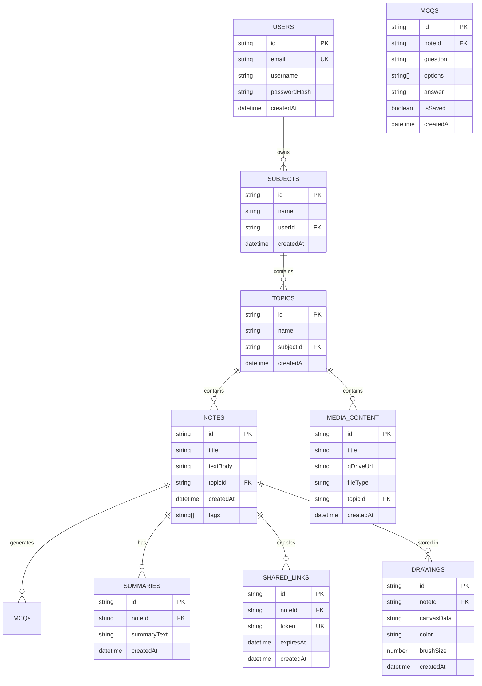

# My Notebook: Personal Knowledge Management & Learning Platform 
## ER Diagram

### Database Schema (PostgreSQL via Prisma)

```mermaid
erDiagram
    direction TB

    %% ===== ENTITIES =====

    USERS {
        string id PK
        string email UK
        string username
        string passwordHash
        datetime createdAt
    }

    SUBJECTS {
        string id PK
        string name
        string userId FK
        datetime createdAt
    }

    TOPICS {
        string id PK
        string name
        string subjectId FK
        datetime createdAt
    }

    NOTES {
        string id PK
        string title
        string textBody
        string topicId FK
        datetime createdAt
        string[] tags
    }

    MEDIA_CONTENT {
        string id PK
        string title
        string gDriveUrl
        string fileType
        string topicId FK
        datetime createdAt
    }

    MCQS {
        string id PK
        string noteId FK
        string question
        string[] options
        string answer
        boolean isSaved
        datetime createdAt
    }

    SUMMARIES {
        string id PK
        string noteId FK
        string summaryText
        datetime createdAt
    }

    SHARED_LINKS {
        string id PK
        string noteId FK
        string token UK
        datetime expiresAt
        datetime createdAt
    }

    DRAWINGS {
        string id PK
        string noteId FK
        string canvasData
        string color
        number brushSize
        datetime createdAt
    }

    %% ===== RELATIONSHIPS =====

    USERS ||--o{ SUBJECTS : "owns"
    SUBJECTS ||--o{ TOPICS : "contains"
    TOPICS ||--o{ NOTES : "contains"
    TOPICS ||--o{ MEDIA_CONTENT : "contains"
    
    NOTES ||--o{ MCQs : "generates"
    NOTES ||--o{ SUMMARIES : "has"
    NOTES ||--o{ SHARED_LINKS : "enables"
    NOTES ||--o{ DRAWINGS : "stored in"
```
