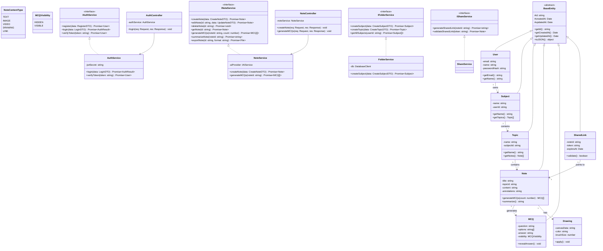

# My Notebook: Personal Knowledge Management & Learning Platform 
## Class Diagram

```mermaid
classDiagram
    direction TB

    %% ===== ENUMS =====
    class NoteContentType {
        TEXT
        IMAGE
        VIDEO
        DRAWING
        LINK
    }

    class MCQVisibility {
        HIDDEN
        VISIBLE
    }

    %% ===== INTERFACES =====
    class IAuthService {
        <<interface>>
        +register(data: RegisterDTO) Promise~User~
        +login(data: LoginDTO) Promise~AuthResult~
        +verifyToken(token: string) Promise~User~
    }

    class INoteService {
        <<interface>>
        +createNote(data: CreateNoteDTO) Promise~Note~
        +editNote(id: string, data: UpdateNoteDTO) Promise~Note~
        +deleteNote(id: string) Promise~void~
        +getNote(id: string) Promise~Note~
        +generateMCQs(noteId: string, count: number) Promise~MCQ[]~
        +summarizeNote(noteId: string) Promise~string~
        +exportNote(id: string, format: string) Promise~File~
    }

    class IFolderService {
        <<interface>>
        +createSubject(data: CreateSubjectDTO) Promise~Subject~
        +createTopic(data: CreateTopicDTO) Promise~Topic~
        +getAllSubjects(userId: string) Promise~Subject[]~
    }

    class IShareService {
        <<interface>>
        +generateSharedLink(noteId: string) Promise~string~
        +validateSharedLink(token: string) Promise~Note~
    }

    %% ===== BASE CLASS =====
    class BaseEntity {
        <<abstract>>
        #id: string
        #createdAt: Date
        #updatedAt: Date
        +getId() string
        +getCreatedAt() Date
        +getUpdatedAt() Date
        +toJSON() object
    }

    %% ===== MODEL CLASSES =====
    class User {
        -email: string
        -name: string
        -passwordHash: string
        +getEmail() string
        +getName() string
    }

    class Subject {
        -name: string
        -userId: string
        +getName() string
        +getTopics() Topic[]
    }

    class Topic {
        -name: string
        -subjectId: string
        +getName() string
        +getNotes() Note[]
    }

    class Note {
        -title: string
        -topicId: string
        -content: string
        -annotations: string
        +generateMCQs(count: number) MCQ[]
        +summarize() string
    }

    class MCQ {
        -question: string
        -options: string[]
        -answer: string
        -visibility: MCQVisibility
        +revealAnswer() void
    }

    class SharedLink {
        -noteId: string
        -token: string
        -expiresAt: Date
        +validate() boolean
    }

    class Drawing {
        -canvasData: string
        -color: string
        -brushSize: number
        +apply() void
    }

    %% ===== SERVICE CLASSES =====
    class AuthService {
        -jwtSecret: string
        +login(data: LoginDTO) Promise~AuthResult~
        +verifyToken(token: string) Promise~User~
    }

    class NoteService {
        -aiProvider: IAIService
        +createNote(data: CreateNoteDTO) Promise~Note~
        +generateMCQs(noteId: string) Promise~MCQ[]~
    }

    class FolderService {
        -db: DatabaseClient
        +createSubject(data: CreateSubjectDTO) Promise~Subject~
    }

    %% ===== CONTROLLER CLASSES =====
    class AuthController {
        -authService: AuthService
        +login(req: Request, res: Response) void
    }

    class NoteController {
        -noteService: NoteService
        +createNote(req: Request, res: Response) void
        +generateMCQs(req: Request, res: Response) void
    }

    %% ===== INHERITANCE =====
    BaseEntity <|-- User
    BaseEntity <|-- Subject
    BaseEntity <|-- Topic
    BaseEntity <|-- Note
    BaseEntity <|-- MCQ
    BaseEntity <|-- SharedLink

    %% ===== INTERFACE IMPLEMENTATIONS =====
    IAuthService <|.. AuthService
    INoteService <|.. NoteService
    IFolderService <|.. FolderService
    IShareService <|.. ShareService

    %% ===== RELATIONSHIPS =====
    User "1" --> "*" Subject : owns
    Subject "1" --> "*" Topic : contains
    Topic "1" --> "*" Note : contains
    Note "1" --> "*" MCQ : generates
    Note "1" --> "*" Drawing : has
    SharedLink "1" --> "1" Note : points to

    %% ===== DEPENDENCIES =====
    NoteController --> NoteService
    AuthController --> AuthService
```
