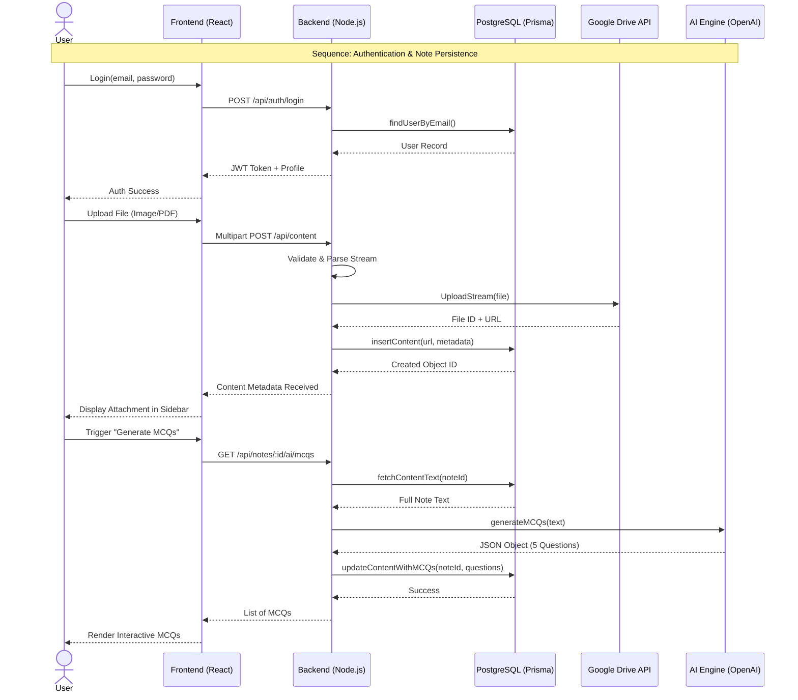

# My Notebook: Personal Knowledge Management & Learning Platform
## Sequence Diagram

### Main Flow: Upload, Storage & AI Processing

```mermaid
sequenceDiagram
    
    actor User
    participant App as Frontend (React)
    participant API as Backend (Node.js)
    participant DB as PostgreSQL (Prisma)
    participant GDrive as Google Drive API
    participant AI as AI Engine (OpenAI)

    %% Authentication Flow
    Note over User, AI: Sequence: Authentication & Note Persistence

    User->>App: Login(email, password)
    App->>API: POST /api/auth/login
    API->>DB: findUserByEmail()
    DB-->>API: User Record
    API-->>App: JWT Token + Profile
    App-->>User: Auth Success

    %% Content Upload & Persistence
    User->>App: Upload File (Image/PDF)
    App->>API: Multipart POST /api/content
    API->>API: Validate & Parse Stream
    API->>GDrive: UploadStream(file)
    GDrive-->>API: File ID + URL
    API->>DB: insertContent(url, metadata)
    DB-->>API: Created Object ID
    API-->>App: Content Metadata Received
    App-->>User: Display Attachment in Sidebar

    %% AI Processing
    User->>App: Trigger "Generate MCQs"
    App->>API: GET /api/notes/:id/ai/mcqs
    API->>DB: fetchContentText(noteId)
    DB-->>API: Full Note Text
    API->>AI: generateMCQs(text)
    AI-->>API: JSON Object (5 Questions)
    API->>DB: updateContentWithMCQs(noteId, questions)
    DB-->>API: Success
    API-->>App: List of MCQs
    App-->>User: Render Interactive MCQs
```
