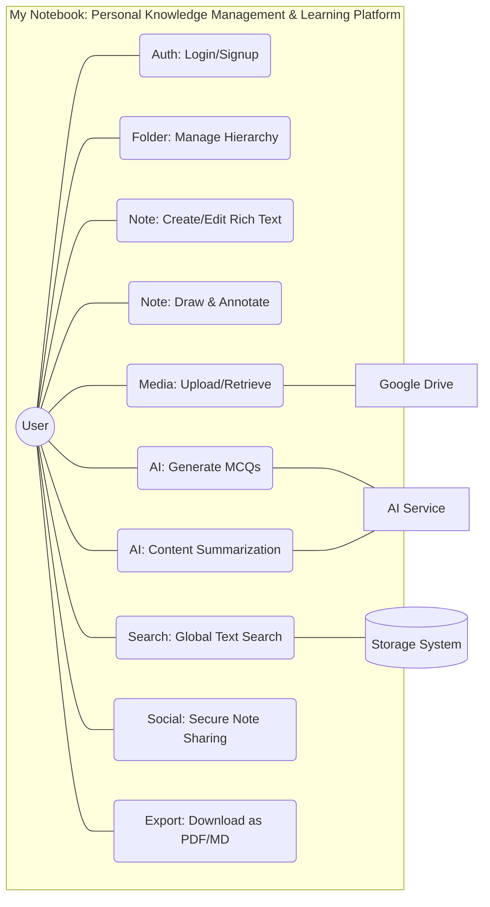

# My Notebook: Personal Knowledge Management & Learning Platform 
## Use Case Diagram

```mermaid
flowchart LR
    %% Actors
    User((User))
    GDrive[Google Drive]
    AI[AI Service]
    DB[(Storage System)]

    subgraph System ["My Notebook: Personal Knowledge Management & Learning Platform"]
        UC1(Auth: Login/Signup)
        UC2(Folder: Manage Hierarchy)
        UC3(Note: Create/Edit Rich Text)
        UC4(Note: Draw & Annotate)
        UC5(Media: Upload/Retrieve)
        UC6(AI: Generate MCQs)
        UC7(AI: Content Summarization)
        UC8(Search: Global Text Search)
        UC9(Social: Secure Note Sharing)
        UC10(Export: Download as PDF/MD)
    end

    %% User Interactions
    User --- UC1
    User --- UC2
    User --- UC3
    User --- UC4
    User --- UC5
    User --- UC6
    User --- UC7
    User --- UC8
    User --- UC9
    User --- UC10

    %% System Interactions
    UC5 --- GDrive
    UC6 --- AI
    UC7 --- AI
    UC8 --- DB
```
